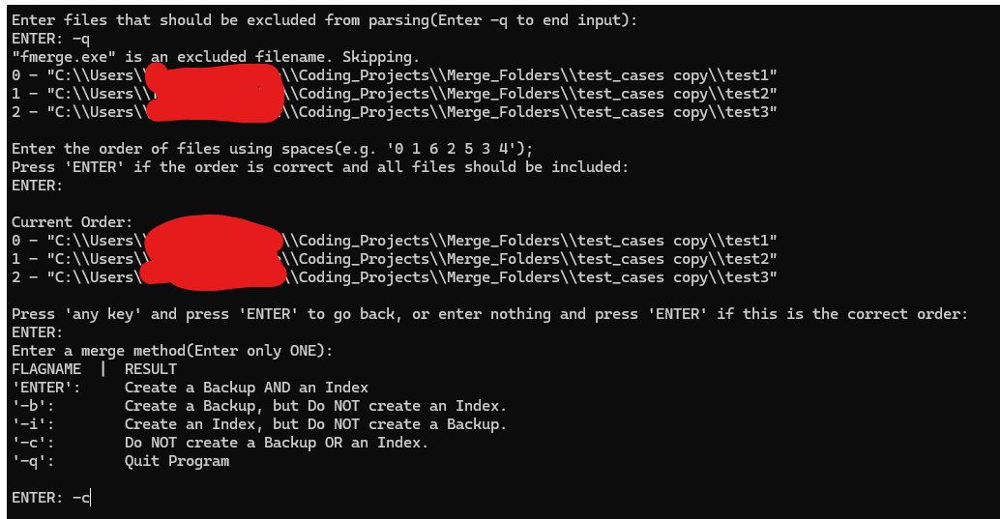
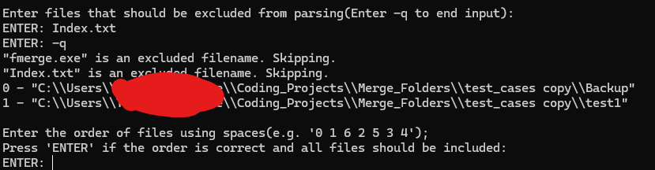
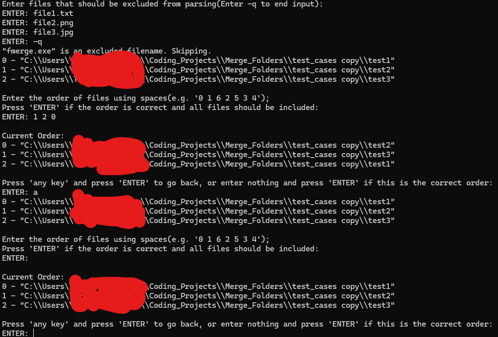
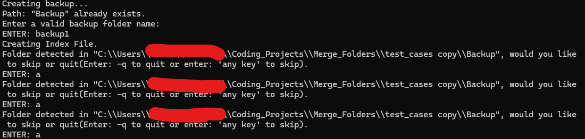
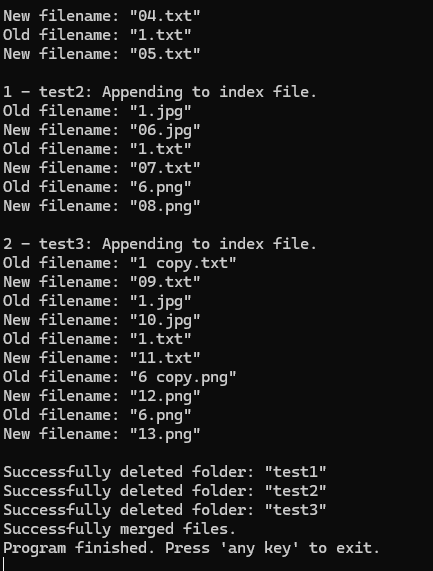
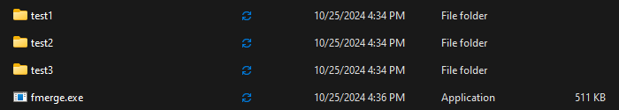

# Folder Merger
## Overview
Merges multiple folders into one folder containing numbered files. Useful for image slideshow downloads or other s
## Features






<!---  = Add Images With This Method--->

## How to Use
txt file showing how to use included in release folder

1. Place File in a directory
2. Run the file
3. Follow instructions...
4. and voila! Your files are now merged in ascending order.

### Download
**From zip**
1. Download latest release
2. Extract folder

**From source files**
1. Clone project to machine
2. Compile main.cpp with (must be c++17 or above)
```console
g++ src/main.cpp src/folder_merger.cpp -o fmerge
```

**From CMake**
1. Run these commands
```console
mkdir build
cd build
cmake ../
cd ..
cmake --build build
```
* Using GCC, exe file will be located in build/
* Using MSVC, exe file will be located in build/Debug/

### Running program
1. Place fmerge.exe in a directory

2. Double click file OR run open folder in terminal and run this command:
```console
FolderMerger.exe
```
3. Follow instructions written in program.

## License
[MIT License](https://github.com/BroknApples/Multi-Program-Runner-Script/blob/main/LICENSE.md)